## **Documentation for Project 16**

### Automate Infrastructure With IAC using Terraform Part 1

### Creating an IAM User with Programatic access

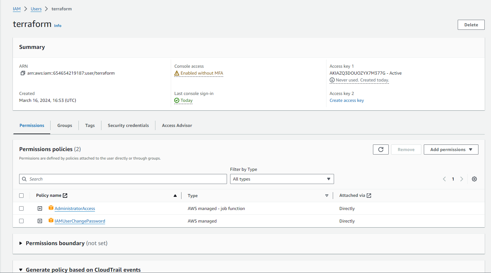

### Boto3 Installation

### Installing AWS CLI

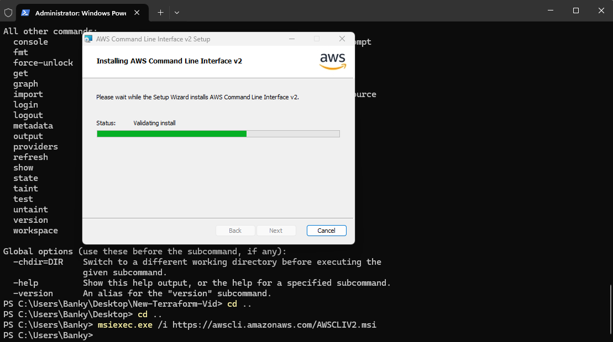

### Configuring my credentials for CLI to authenticate with AWS and also for terraform to Authenticate with AWS

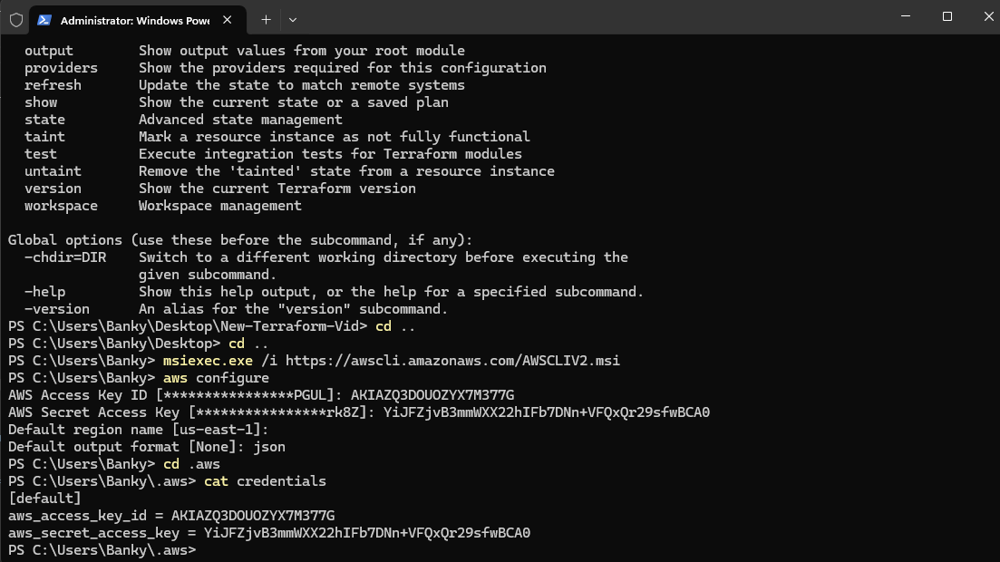

### Creating S3 Bucket

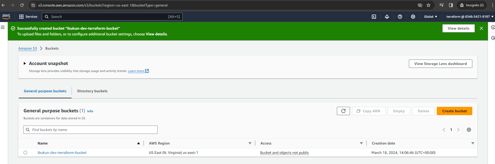

### Ran AWS s3 LS on CLI to List the bucket i've just created

`aws s3 ls`
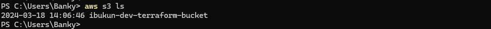

### Initializing Terraform in our working Directory

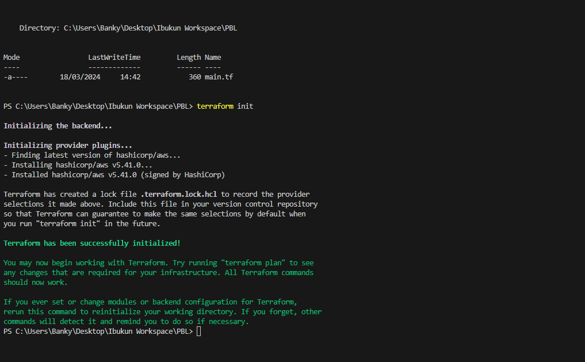

### Specifying our Provider and Creating a VPC

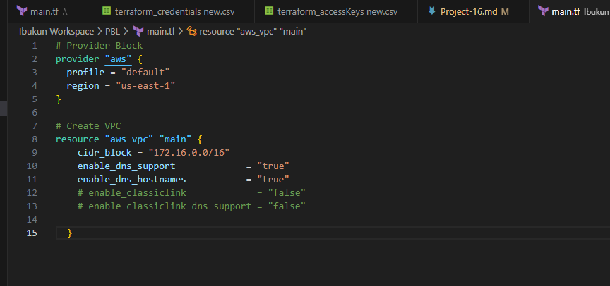

### Running Terraform Plan to show the resource that is about to be Created

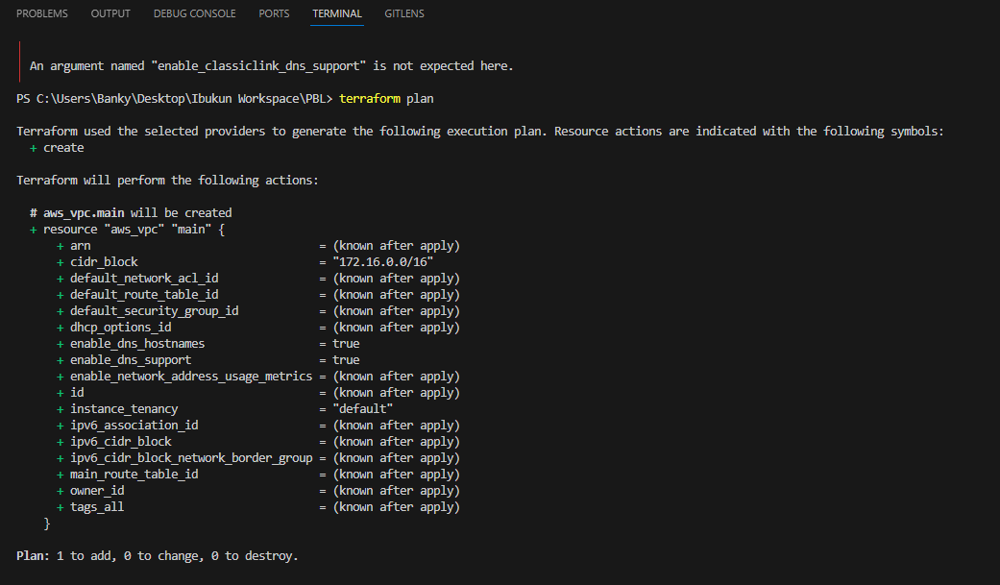

### Creating our Subnets resource
`terraform plan`

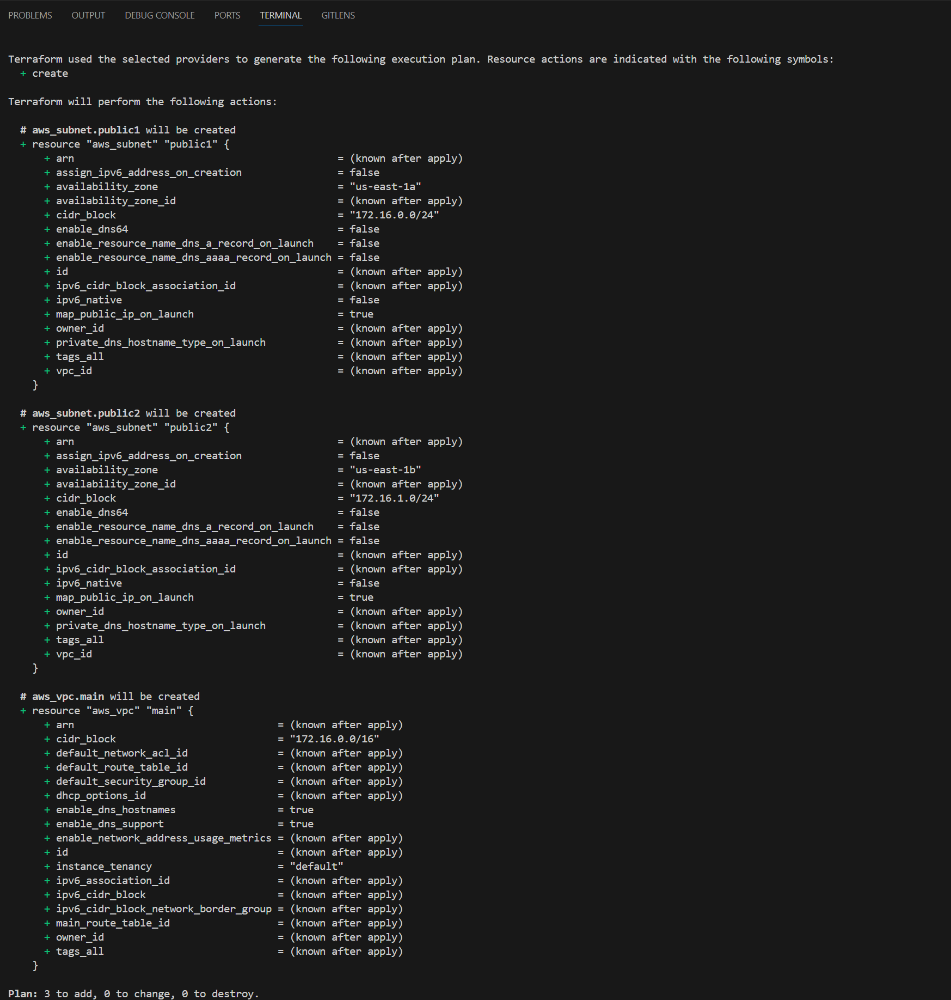

`terraform apply`

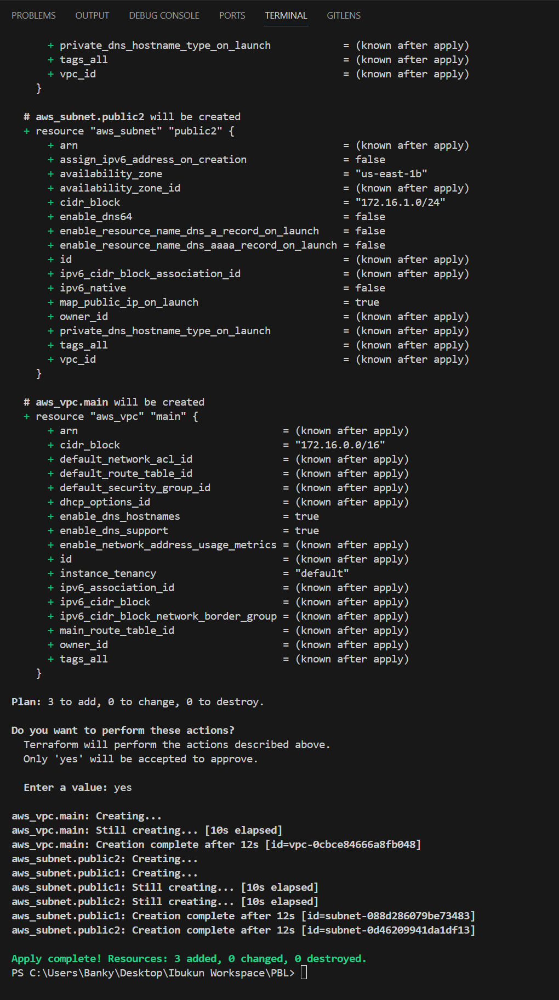

### VPC Created
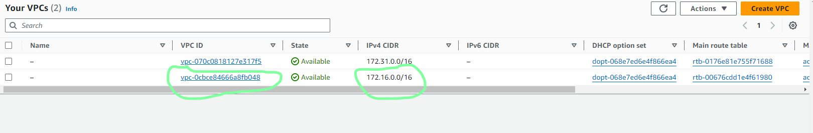

### 2 Public Subnets Created after apply
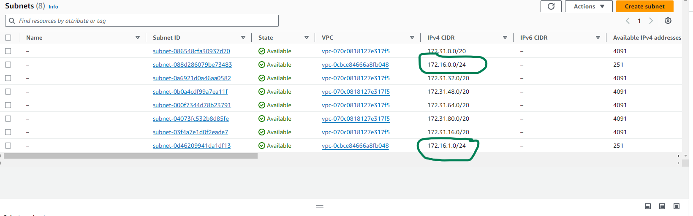

### Destroying the resources created
`terraform destroy`
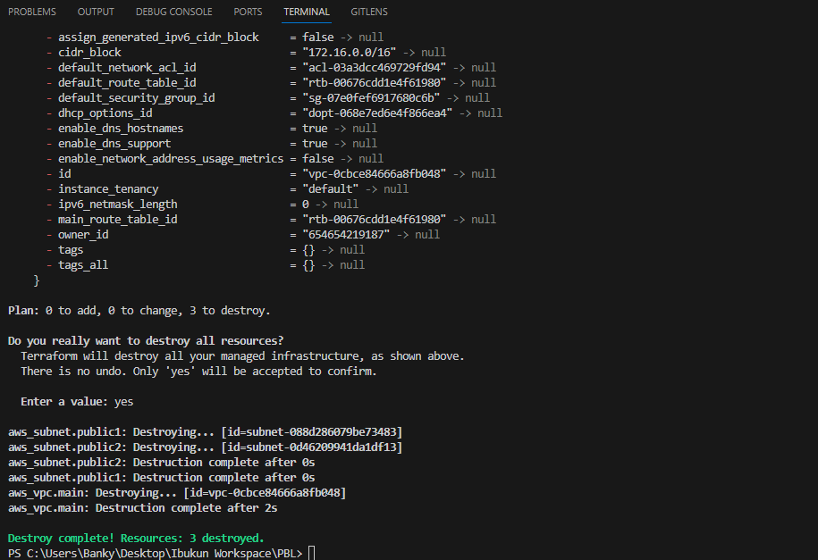

### Refactoring pur Code by Fixing Hard Coded Values

### Creating a Variables.tf file to keep variables for our Hardcoded Values
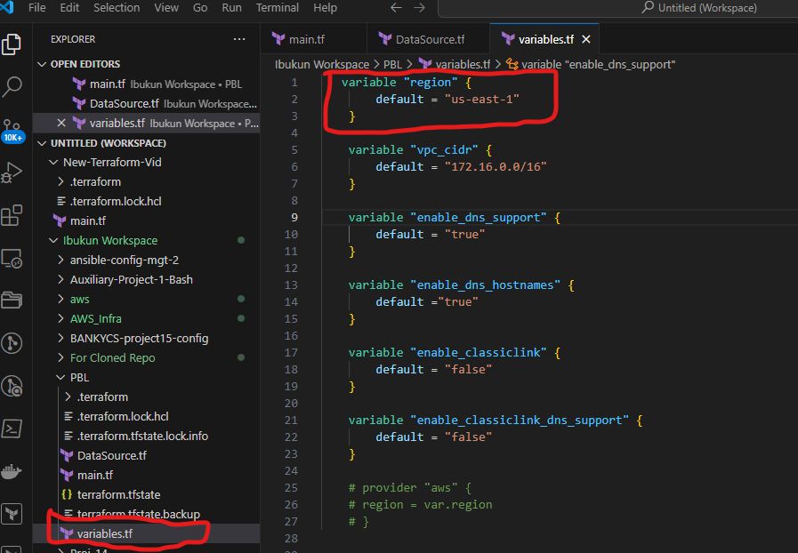

### Fixing multiple resource blocks

### Creating a Datasource.tf file to keep our datasource variables which will fetch data from AWS for available resources

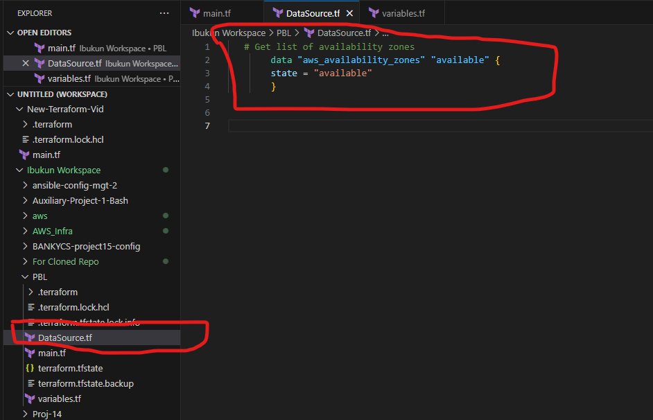

### Refferencing our Variables in Main.tf file

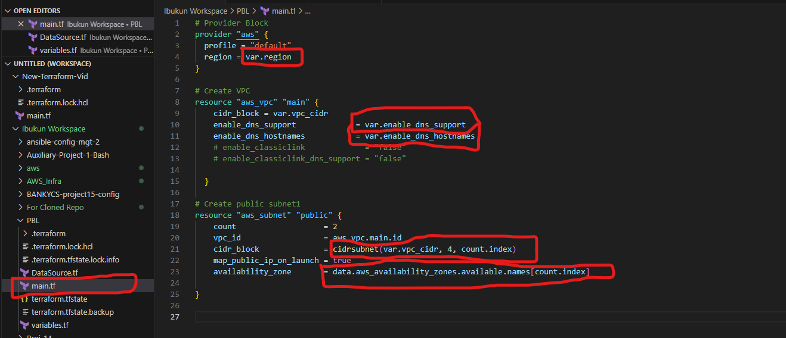

### Removing hardcoded count value for our multiple subnet creation using length() function

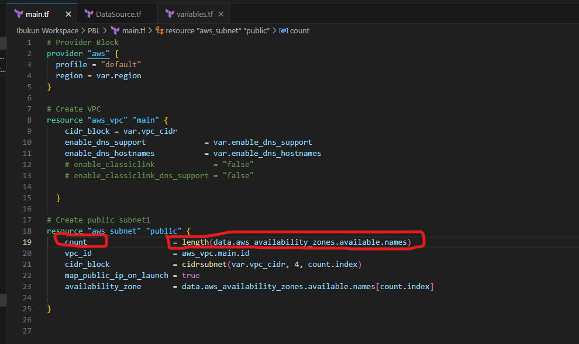

### Declaring a variable to store the desired number of public subnets we need and setting the default value.

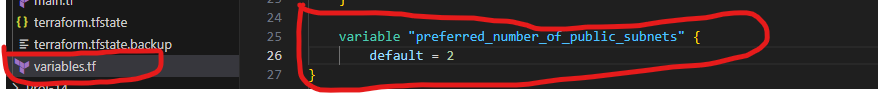

### Refferencing the variable for our preffered number of public subnet in our Main.tf file

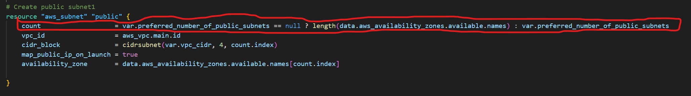

### Terraform format to arrange our code
`terraform fmt`

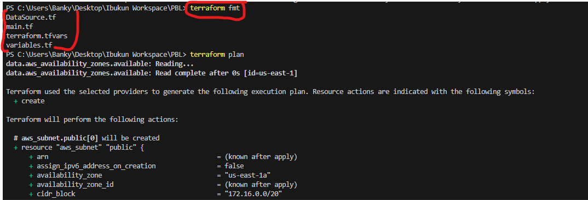

### Terraform apply with --auto-approve to create our resources

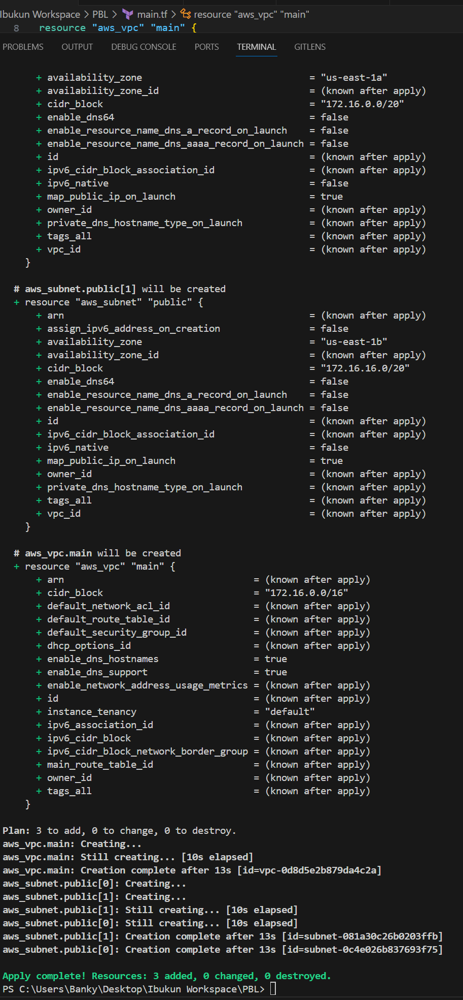

### Resources Created

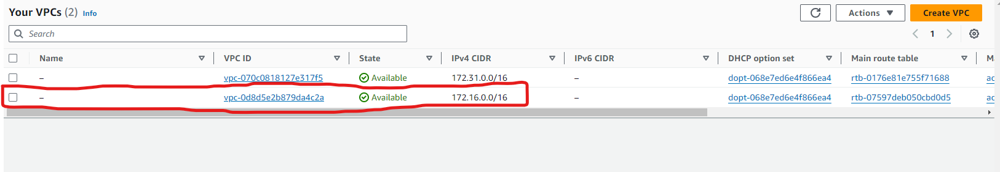

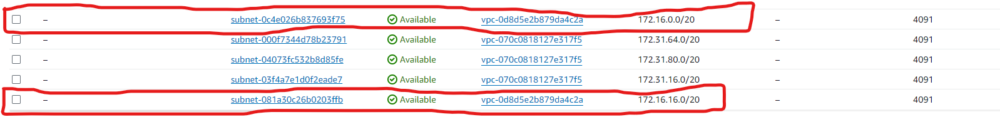