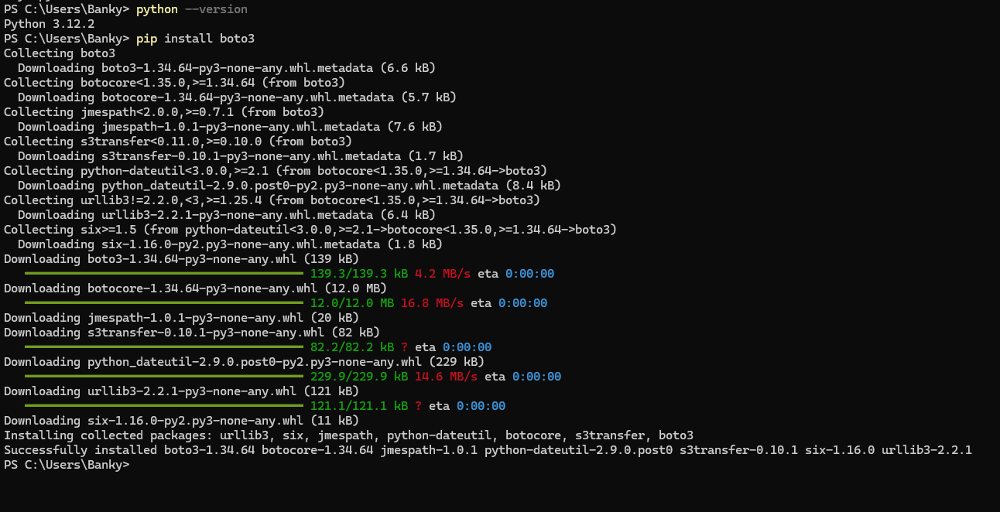

## **Documentation for Project 16**

### Automate Infrastructure With IAC using Terraform Part 1

### Creating an IAM User with Programatic access

### Boto3 Installation

### Installing AWS CLI

### Configuring my credentials for CLI to authenticate with AWS and also for terraform to Authenticate with AWS

### Creating S3 Bucket

### Ran AWS s3 LS on CLI to List the bucket i've just created

`aws s3 ls`

### Initializing Terraform in our working Directory

### Specifying our Provider and Creating a VPC

### Running Terraform Plan to show the resource that is about to be Created

### Creating our Subnets resource
`terraform plan`

`terraform apply`

### VPC Created

### 2 Public Subnets Created after apply

### Destroying the resources created
`terraform destroy`

### Refactoring pur Code by Fixing Hard Coded Values

### Creating a Variables.tf file to keep variables for our Hardcoded Values

### Fixing multiple resource blocks

### Creating a Datasource.tf file to keep our datasource variables which will fetch data from AWS for available resources

### Refferencing our Variables in Main.tf file

### Removing hardcoded count value for our multiple subnet creation using length() function

### Declaring a variable to store the desired number of public subnets we need and setting the default value.

### Refferencing the variable for our preffered number of public subnet in our Main.tf file

### Terraform format to arrange our code
`terraform fmt`

### Terraform apply with --auto-approve to create our resources

### Resources Created

